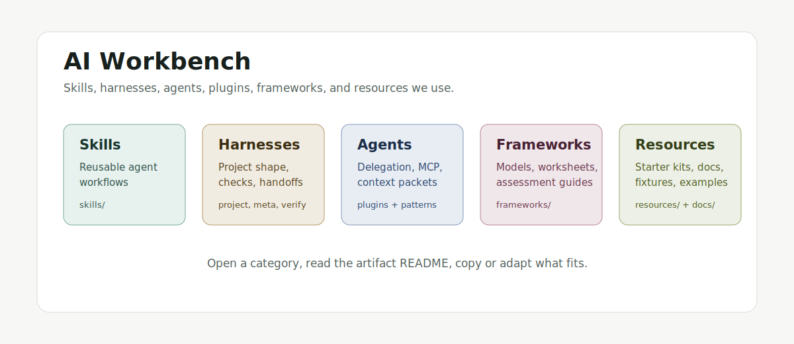

# AI Workbench

Skills, harnesses, agents, plugins, frameworks, and resources built and used for agentic AI work.

This is a selective working collection, not a prompt dump. Most of it came from repeated use: keeping agents scoped, designing project harnesses, managing context, choosing verification paths, and moving deterministic work out of prompts and into code or checks.

## Overview

| Group | What's In It | Where To Look |
| --- | --- | --- |
| Frameworks | Models and worksheets for thinking about AI adoption, maturity, and operating constraints. | [SMB AI Maturity Model](frameworks/smb-ai-maturity-model/README.md) |
| Patterns | Reusable workflow shapes for splitting, routing, verifying, and repeating agent work. | [Agent Workflow Patterns](patterns/agent-workflow-patterns/README.md) |
| Skills | Reusable instructions for recurring agent work: writing, triage, diagramming, auth handling, MCP work, model councils, research, and context boundaries. | [skills](skills/) and [docs/skills.md](docs/skills.md) |
| Harnesses | Operating patterns for starting projects, composing nested work, routing verification, and keeping larger agent tasks coherent. | [project-harness-designer](skills/project-harness-designer/README.md), [harness-composer](skills/harness-composer/README.md), [verification-harness-router](skills/verification-harness-router/README.md) |
| Agents and Plugins | Patterns for delegation, sidecar agents, MCP servers, tool boundaries, and context packets. | [nested-agent-orchestrator](skills/nested-agent-orchestrator/README.md), [mcp-build](skills/mcp-build/README.md), [context-boundary-designer](skills/context-boundary-designer/README.md) |
| Benchmarks | Dataset prep and scoring harnesses for evaluating skills and agent workflows. | [Model Council DRACO Benchmark](benchmarks/model-council-draco/README.md) |
| Resources | Starter kits, examples, diagrams, eval fixtures, and reference docs that make the patterns easier to adapt. | [AGENTS example](resources/codex/AGENTS.example.md), [Codex sync workflow](resources/codex/codex-config-sync-workflow.md), [resources](resources/) |

Most artifacts have their own README with usage notes, examples, and the smallest useful check or fixture.

## Notable

### Project Harness Designer

[Project Harness Designer](skills/project-harness-designer/README.md) turns a fuzzy project start into a compact operating frame: intent, success evidence, risks, work mode, verification loop, and first path. It is the pattern I reach for when a request is bigger than a single edit but does not need heavyweight project planning.

### Agent Memory

[Agent Memory Starter](docs/agent-memory-starter.md) is a source-backed memory pattern for agents. It uses curated pages, timeline evidence, searchable chunks, update proposals, fake fixtures, and a retrieval eval so memory can be inspected and tested instead of becoming a transcript pile.

### Model Council And Deep Research

[Model Council](skills/model-council/README.md) runs independent model workers and a separate synthesis pass, with local CLI routes for Codex, Claude Code, Antigravity, and Grok Build plus a Vercel AI Gateway option. [Deep Research](skills/deep-research/README.md) keeps source-backed research disciplined and escalates difficult synthesis to the council pattern. The companion [runner](tools/model-council-runner/README.md) supports dry-run planning, manifests, and route validation. [Model Council DRACO Benchmark](benchmarks/model-council-draco/README.md) is a separate benchmark package for evaluating the council skill.

### Meta-Harnesses

The meta-harness pieces are for shaping larger agent workflows: [Harness Composer](skills/harness-composer/README.md) for parent and child workstreams, [Nested Agent Orchestrator](skills/nested-agent-orchestrator/README.md) for delegation, [Verification Harness Router](skills/verification-harness-router/README.md) for choosing checks, and [Context Boundary Designer](skills/context-boundary-designer/README.md) for deciding what context belongs where.

### Agent Workflow Patterns

[Agent Workflow Patterns](patterns/agent-workflow-patterns/README.md) is a diagram-backed catalog for choosing classify-and-act, fan-out-and-synthesize, adversarial verification, generate-and-filter, tournament, loop-until-done, and quarantine-and-act workflows.

### Deterministic Controls

[Deterministic Controls](skills/deterministic-controls/README.md) helps decide when model judgment is the wrong tool. It pushes exact formats, permission gates, routing, retries, release checks, and auditability into schemas, state machines, validators, tests, or other deterministic controls.

### Codex Operating Resources

[AGENTS example](resources/codex/AGENTS.example.md) is a cleaned-up global instruction template for pragmatic coding-agent defaults. [Codex sync workflow](resources/codex/codex-config-sync-workflow.md) covers the live-home versus versioned-mirror pattern for keeping reusable Codex instructions, skills, agents, config templates, and setup scripts aligned across machines.
