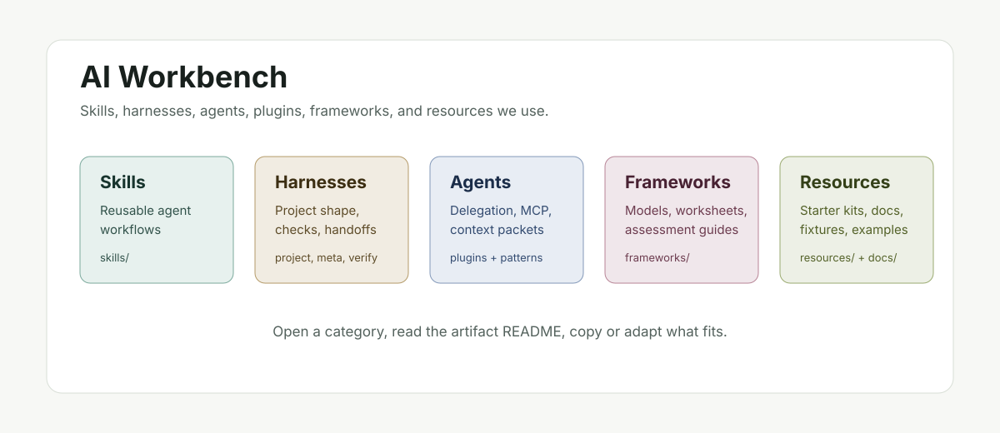

<h1 align="center">AI Workbench</h1>

<p align="center">
  <strong>Curated public skills, reference architecture, harness patterns, and small tools for practical agentic AI work.</strong>
  <br/>
  A selective collection for studying and adapting scoped, verifiable agent workflows without publishing a private working environment.
</p>

<p align="center">
  <a href="LICENSE"></a>
  
  <a href="docs/skills.md"></a>
  <a href="docs/architecture/README.md"></a>
</p>

<p align="center">
  
</p>

> **Public alpha:** AI Workbench is a curated reference repository, not a packaged product or a mirror of a maintainer's live agent setup. Every listed `SKILL.md` passes the repository's structural contract, but some packages are sanitized projections, illustrative examples, or superseded standalone patterns. Check the [public catalog](docs/skills.md) before adapting one.

> **Release posture:** no versioned release, plugin, compatibility guarantee, or automatic update channel is currently published.

Built and maintained by [Jarel Remick](https://github.com/jremick).

## What is AI Workbench?

AI Workbench collects public-safe agent artifacts: skills, workflow patterns, project harnesses, model-council tools, adoption frameworks, starter kits, diagrams, fixtures, and deterministic checks.

The repository has two jobs:

1. Publish maintained examples and reusable public projections.
2. Explain an architecture for keeping large skill libraries discoverable without injecting every workflow into every prompt.

It intentionally does not publish raw live profiles, personal or work-only skills, provider caches, credentials, account state, memory, sessions, transcripts, or machine-specific configuration.

## Publication model

```text
working environment
      ↓ metadata-only comparison
allowlisted public candidate
      ↓ human abstraction, redaction, and claim review
AI Workbench public source
      ↓ deterministic catalog and validation
reviewed public artifacts
```

The canonical public lifecycle record is [catalog/artifacts.json](catalog/artifacts.json). The readable [skills catalog](docs/skills.md) is generated from it.

Public artifacts use four classes:

- **Current public snapshot** — maintained here as a usable dated snapshot.
- **Curated public projection** — deliberately abstracted from a broader working pattern.
- **Illustrative example** — useful for study without a live-parity claim.
- **Superseded standalone pattern** — retained for history or concepts, with a successor direction named.

## Quick start

Prerequisites: Git and Python 3.10 or newer. The repository's core validation scripts use only the Python standard library.

```bash
git clone https://github.com/jremick/ai-workbench.git
cd ai-workbench

python3 scripts/validate_public_catalog.py
python3 scripts/render_public_catalog.py --check
python3 scripts/check_markdown_links.py
python3 scripts/check_public_boundaries.py
```

Then browse by category:

| Group | What's in it | Start here |
| --- | --- | --- |
| Reference architecture | Progressive disclosure, lifecycle, ownership/visibility, and router patterns | [Architecture](docs/architecture/README.md) |
| Skills | All 19 packages, classified by public role and evidence | [Public skill catalog](docs/skills.md) |
| Frameworks | Models and worksheets for adoption, maturity, and operating constraints | [SMB AI Maturity Model](frameworks/smb-ai-maturity-model/README.md) |
| Patterns | Workflow shapes for splitting, routing, verifying, and repeating work | [Agent Workflow Patterns](patterns/agent-workflow-patterns/README.md) |
| Tools | Deterministic starter kits and runners | [Agent Memory Starter](tools/agent-memory-starter/README.md), [Model Council Runner](tools/model-council-runner/README.md) |
| Benchmarks | Dataset preparation and scoring harnesses | [Model Council DRACO Benchmark](benchmarks/model-council-draco/README.md) |
| Historical resources | Dated Codex examples retained for adaptation, not current architecture | [Codex operating resources](resources/codex/README.md) |

## Using a skill

Read the package README and its catalog classification first. For local Codex authoring, a selected skill can be copied into a repository-level `.agents/skills` directory:

```bash
mkdir -p .agents/skills
cp -R skills/war-council .agents/skills/
```

Other hosts may use different directories or packaging. OpenAI currently recommends plugins when distributing reusable skills beyond local or repository authoring; this repository does not yet publish a plugin. See [OpenAI's skill guidance](https://learn.chatgpt.com/docs/build-skills).

Structural validation confirms the public file contract. It does not establish that a skill is useful for a particular task, safe for every environment, compatible with every host, or behaviorally accepted. Run package-specific checks and review tool, auth, model, and MCP assumptions before use.

## Reference architecture

The architecture keeps four states separate:

| State | Meaning |
| --- | --- |
| Installed or cached | Skill source exists somewhere the host can access |
| Prompt-visible | Skill metadata is present in the current model context |
| Router-retrievable | The active host or profile can resolve it for a matching task |
| Activated | The complete workflow is loaded for this task |

The public six-domain router example covers agent operations, knowledge and communication, artifact production, engineering delivery, connected systems, and tooling/platform work. It is Jarel's reference pattern, not an official OpenAI architecture and not a disclosure of private route tables. See [Router pattern](docs/architecture/router-pattern.md).

## Verification

The default checks cover:

- manifest and skill-directory coherence;
- current public `SKILL.md` frontmatter rules;
- generated catalog drift;
- relative Markdown links and images;
- narrow current-tree private-path and secret-pattern checks;
- selected package validators, tests, fixtures, and documented eval cases.

Package-specific checks include:

```bash
python3 scripts/validate_model_council_package.py
python3 scripts/validate_model_manager_package.py
python3 tools/agent-memory-starter/scripts/run_fixture_eval.py
python3 skills/deterministic-controls/scripts/run_evals.py
python3 skills/war-council/scripts/war_council.py self-test
```

These checks have bounded claims. In particular, package-authored fixtures are not independent acceptance evidence, and current-tree hygiene does not replace Git-history secret review.

## Known limitations

- Some provider, model, auth, MCP, and CLI guidance is time-sensitive.
- Six standalone skills are retained as superseded snapshots for historical value.
- Current snapshots do not imply permanent parity with private or newer variants.
- There is no clean-environment compatibility matrix or supported-host guarantee.
- The committed social-preview image is an asset only; GitHub's custom preview is not currently asserted as applied.

## Documentation

- [Public skill catalog](docs/skills.md) — all packages, classifications, versions, relationships, and evidence.
- [Reference architecture](docs/architecture/README.md) — publication boundaries and update flow.
- [Skill lifecycle](docs/architecture/skill-lifecycle.md) — classes, relationships, and transitions.
- [Ownership and visibility](docs/architecture/ownership-and-visibility.md) — installed, visible, retrievable, and activated states.
- [Patterns](patterns/README.md) — reusable workflow shapes.
- [Resources](resources/README.md) — dated starter material and reference examples.

## Community and support

- [Issues](https://github.com/jremick/ai-workbench/issues) — broken links, unclear docs, validation failures, and concrete public-safe improvements.
- [Contributing](CONTRIBUTING.md) — contribution scope and required checks.
- [Security policy](SECURITY.md) — private reporting for sensitive findings.

Issues are the maintained public support surface. There is no response-time guarantee, and security findings must not be posted publicly.

## License

[Apache License 2.0](LICENSE) — Copyright 2026 Jarel Remick.
