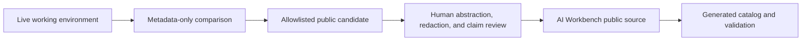

# Public reference architecture

AI Workbench publishes a curated reference architecture for large skill libraries. It is a design pattern, not an export of a maintainer's live Codex home, profiles, plugin caches, or private configuration mirror.

The architecture has four layers:

```text
durable host instructions
        ↓
small prompt-visible domain routers
        ↓
profile-eligible off-prompt skills and provider capabilities
        ↓
task-specific activation of one focused workflow
```

This structure keeps broad operating invariants visible while loading detailed workflows only when a task needs them. OpenAI describes the underlying mechanism as progressive disclosure: hosts first expose skill names and descriptions, then load the complete `SKILL.md` when a skill is selected. See [Build skills](https://developers.openai.com/codex/skills).

## Sources of truth

The public repository uses these boundaries:

| Source | Role |
| --- | --- |
| `catalog/artifacts.json` | Canonical public lifecycle, version, relationship, and validation metadata |
| `catalog/architecture-artifacts.json` | Canonical metadata for synthetic schemas, fixtures, templates, and eval contracts |
| `skills/` | Public skill packages and historical snapshots |
| `architecture/` | Synthetic reference inputs and generated examples; never live exports |
| `docs/skills.md` | Generated reader-facing catalog |
| Private live environment | Operational truth for its owner; never an automatic public input |
| Private configuration mirror | Reusable versioned state for its owner; never a public source of truth |

The public manifest records whether an artifact is a current snapshot, a sanitized projection, an independent example, or a superseded concept. Same names do not imply identical implementation.

## Public update flow



The comparison step may use names, versions, hashes, lifecycle state, and validation results. It must not copy private bodies, profiles, account state, sessions, memory, provider caches, or secrets.

## Supporting documents

- [Official behavior versus this reference architecture](official-vs-reference.md) — which claims come from OpenAI and which are AI Workbench recommendations.
- [Instruction layering](instruction-layering.md) — durable `AGENTS.md` instructions versus task-specific workflows.
- [Router and registry model](router-and-registry-model.md) — the synthetic schema, registry, generator, and validators.
- [Ownership, availability, awareness, and activation](ownership-availability-awareness.md) — independent architecture dimensions.
- [Profiles and resolution](profiles-and-resolution.md) — synthetic compilation and runtime claim limits.
- [Plugin and provider boundaries](plugin-provider-boundaries.md) — authoring, distribution, cache, and ownership boundaries.
- [Validation, drift, and metrics](validation-drift-and-metrics.md) — evidence levels and metadata-only updates.
- [Distribution, governance, and claim limits](distribution-and-claim-limits.md) — publication lanes and review process.
- [Skill lifecycle](skill-lifecycle.md) — public artifact classes and transitions.
- [Ownership and visibility](ownership-and-visibility.md) — why location, prompt exposure, retrieval, and activation are separate decisions.
- [Router pattern](router-pattern.md) — a public six-domain example without private route assignments.
- [Public skill catalog](../skills.md) — the current classification of all public skill packages.

## Claim limits

- This is Jarel Remick's public reference model, not an official OpenAI architecture.
- Structural validation proves file and catalog contracts, not usefulness, security, or output quality.
- An eval authored inside a package is evidence about that package's cases, not independent acceptance.
- Provider, model, MCP, authentication, and host behavior can change; operational use requires current documentation and runtime verification.
- No release, plugin, compatibility promise, or automatic update channel is currently published from this repository.
