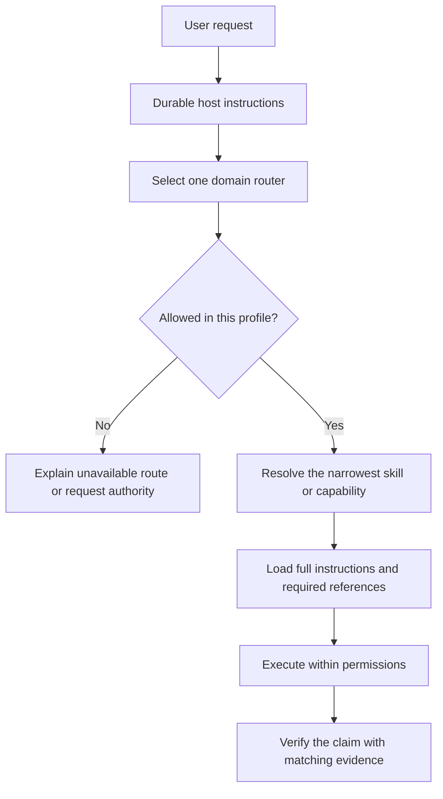

# Router pattern

A router is a small prompt-visible skill that classifies broad intent and loads a narrower workflow. It should not contain every child workflow or duplicate their detailed instructions.

## Example domain routers

One practical six-domain split is:

1. Codex or agent operations — skills, profiles, memory, configuration, and workflow governance.
2. Knowledge and communication — research, synthesis, writing, strategy, and stakeholder material.
3. Artifact production — documents, PDFs, spreadsheets, presentations, diagrams, and reports.
4. Engineering delivery — repositories, implementation, code review, QA, security, UI, and deployment readiness.
5. Connected systems — task trackers, mail, collaboration tools, knowledge systems, and publishing workflows.
6. Tooling and platforms — provider routing, authentication, browser/computer control, hosting, and infrastructure capabilities.

These domains are a public reference pattern. They are not official Codex categories, and they do not disclose any private route table or profile assignment.

## Route flow

## Router contract

A good router should:

- own one clear domain;
- name neighboring domains it does not own;
- select the narrowest child route;
- resolve hidden provider leaves through current host configuration rather than hard-coded cache paths;
- keep environment ownership separate from prompt awareness;
- stop when a required route is unavailable or stale;
- require claim-matched verification before completion.

A router should not:

- paste every child workflow into the always-on prompt;
- treat installed cache content as automatically approved;
- blend personal and work profiles;
- make provider calls or external writes merely because a route exists;
- claim success from prompt-size reduction alone.

## Public versus private detail

Safe public material includes domain boundaries, generic route contracts, lifecycle schemas, and synthetic examples. Keep real child inventories, account permissions, profile resolutions, machine paths, provider cache locations, connector state, and private skills outside the repository.
