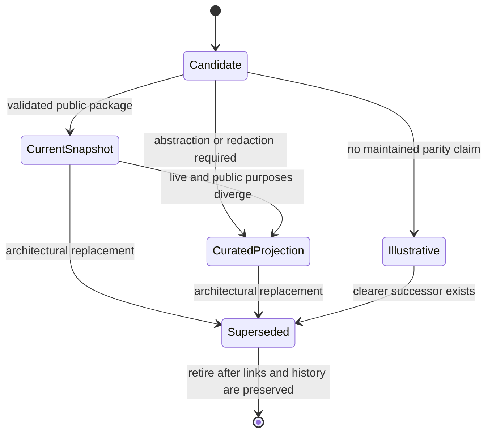

# Public skill lifecycle

The lifecycle separates a public artifact's usefulness from claims about live parity or current installation. The canonical status lives in `catalog/artifacts.json`, not in custom `SKILL.md` frontmatter.

## Publication classes

| Class | Meaning | Reader action |
| --- | --- | --- |
| `current-snapshot` | Maintained here as a usable public snapshot | Read, validate, and adapt to the host |
| `curated-projection` | Deliberately abstracted from a broader working pattern | Treat the public package as its own maintained projection |
| `illustrative-only` | Useful for study or adaptation without a live-parity claim | Do not infer production or live use |
| `superseded` | Standalone pattern replaced by a different architectural placement | Prefer the named successor direction for new systems |

## Relationship to working systems

The manifest records a separate relationship:

- `exact-at-last-comparison` — content matched a named counterpart on the comparison date; it is not a permanent sync guarantee.
- `dated-public-snapshot` — a valid public snapshot existed while a newer private or working variant also existed.
- `sanitized-projection` — public content was deliberately abstracted and is not expected to match a private implementation.
- `independent-public` — the artifact stands on its own and has no live-parity claim.
- `superseded-concept` — the concept was retained, but its standalone placement is no longer current.

## Transitions

Promotion to `current-snapshot` requires:

1. Public-boundary review.
2. Current frontmatter validation.
3. Working links and package-specific checks.
4. A clear compatibility and claim-limit statement.
5. Human confirmation that the public package is intended to be maintained.

Structural checks alone cannot promote an artifact.

## Review triggers

Review an artifact when:

- a selected working counterpart changes materially;
- official host, plugin, MCP, auth, or provider behavior changes;
- a package validator or link check fails;
- a public issue exposes a confusing status or unsafe assumption;
- the scheduled quarterly public-surface review is due.

Drift detection opens a review decision. It must never copy or publish live content automatically.
