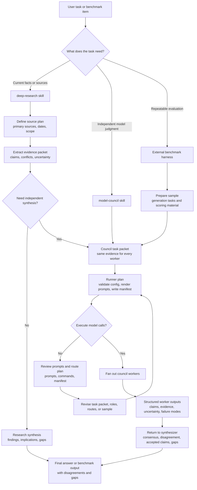
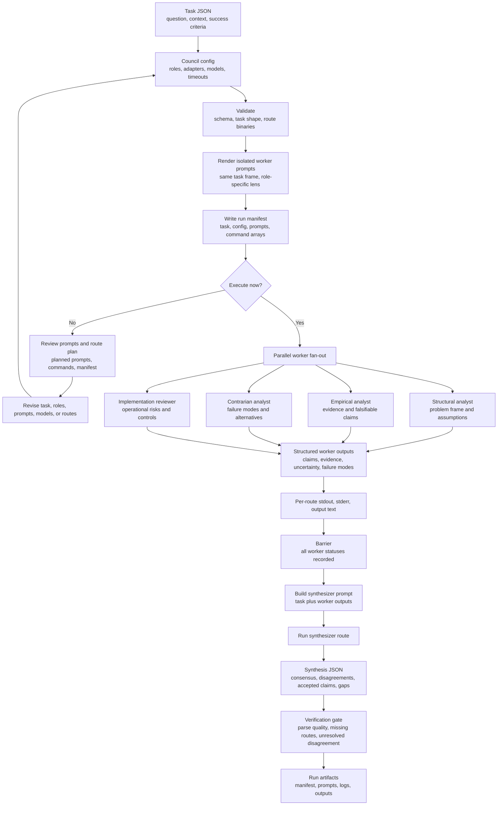
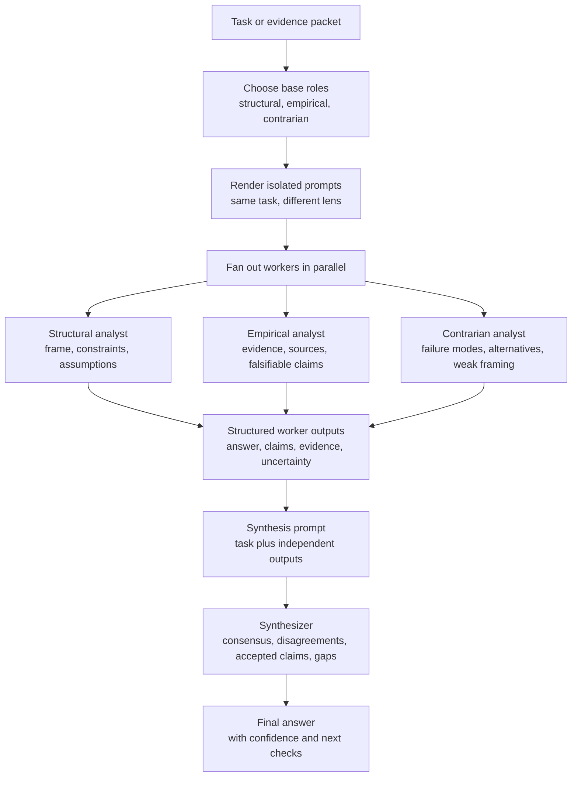
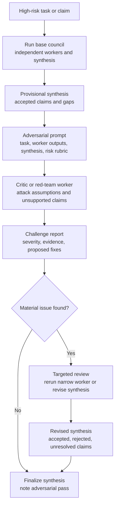
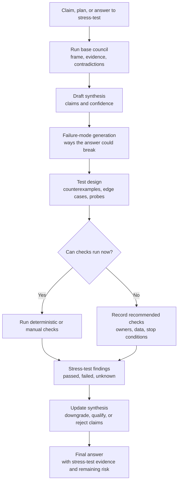
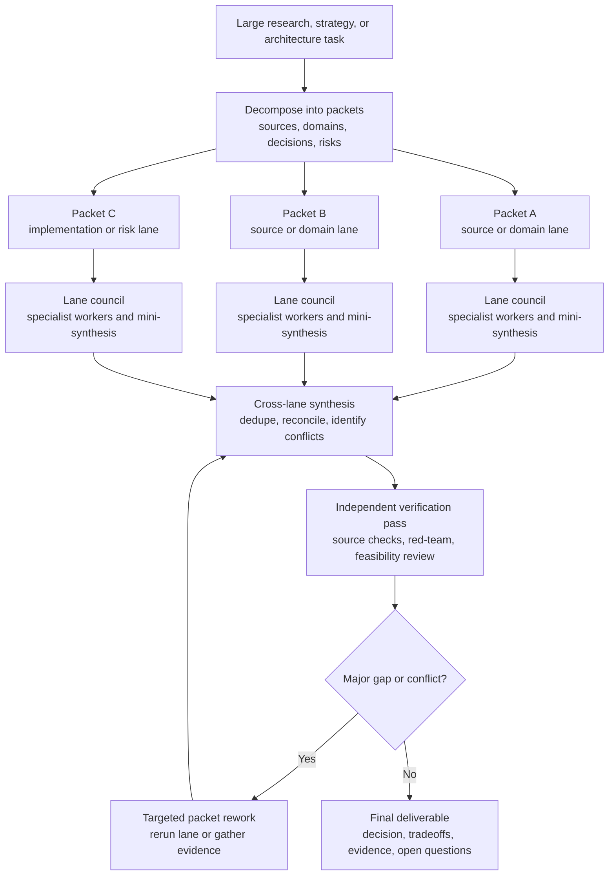
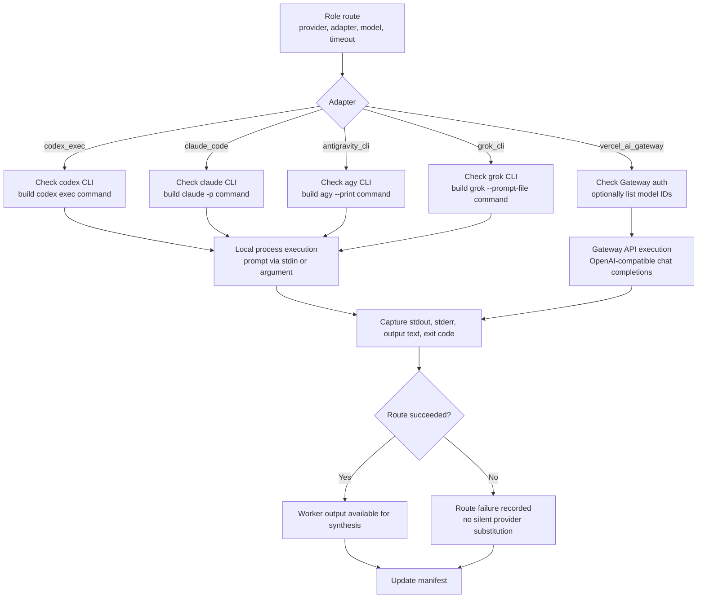
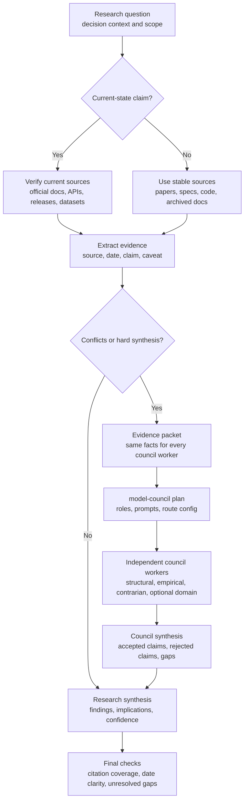

# Model Council And Deep Research

This package adds two skills plus a deterministic runner.

## Skills

| Skill | Purpose |
| --- | --- |
| `model-council` | Runs independent model workers and a separate synthesis pass. |
| `deep-research` | Performs source-backed research and escalates hard synthesis to a council. |

## Workflow Routing



Source: [skill-workflow-routing.mmd](../tools/model-council-runner/diagrams/skill-workflow-routing.mmd)

## Base Council Flow



Source: [base-council-flow.mmd](../tools/model-council-runner/diagrams/base-council-flow.mmd)

## Council Level Workflows

### Base



Source: [council-level-base.mmd](../tools/model-council-runner/diagrams/council-level-base.mmd)

### Adversarial



Source: [council-level-adversarial.mmd](../tools/model-council-runner/diagrams/council-level-adversarial.mmd)

### Stress-Test



Source: [council-level-stress-test.mmd](../tools/model-council-runner/diagrams/council-level-stress-test.mmd)

### Extended



Source: [council-level-extended.mmd](../tools/model-council-runner/diagrams/council-level-extended.mmd)

## Routing

The default route order is:

1. Local CLIs for interactive developer machines.
2. Vercel AI Gateway as an API alternate option for execution and deployment.

Local CLI roles:

| Provider | Route |
| --- | --- |
| OpenAI | Codex CLI |
| Anthropic | Claude Code CLI |
| Google | Antigravity CLI |
| xAI | Grok Build CLI |



Source: [provider-routing.mmd](../tools/model-council-runner/diagrams/provider-routing.mmd)

## Research Escalation



Source: [deep-research-council-escalation.mmd](../tools/model-council-runner/diagrams/deep-research-council-escalation.mmd)

## Deterministic Controls

The runner enforces:

- JSON config for role routing
- isolated worker prompts
- dry-run planning before execution
- command arrays instead of shell strings
- no silent provider fallback
- per-route raw stdout and stderr logs
- explicit manifest status
- credentials read from environment only
- benchmark prompts and grading material can be kept separate by external benchmark harnesses

## Quick Checks

```bash
python3 scripts/validate_model_council_package.py
```

Dry-plan a run:

```bash
python3 tools/model-council-runner/scripts/council_runner.py plan \
  --config tools/model-council-runner/configs/local-cli.base.json \
  --task tools/model-council-runner/fixtures/smoke-task.json \
  --run-dir /tmp/model-council-smoke \
  --force
```

## Benchmarking

Benchmarks are separate from the skills. Use the runner to plan and execute council runs, then use benchmark packages to prepare datasets and scoring material.

The DRACO benchmark package lives at [benchmarks/model-council-draco](../benchmarks/model-council-draco/README.md).
