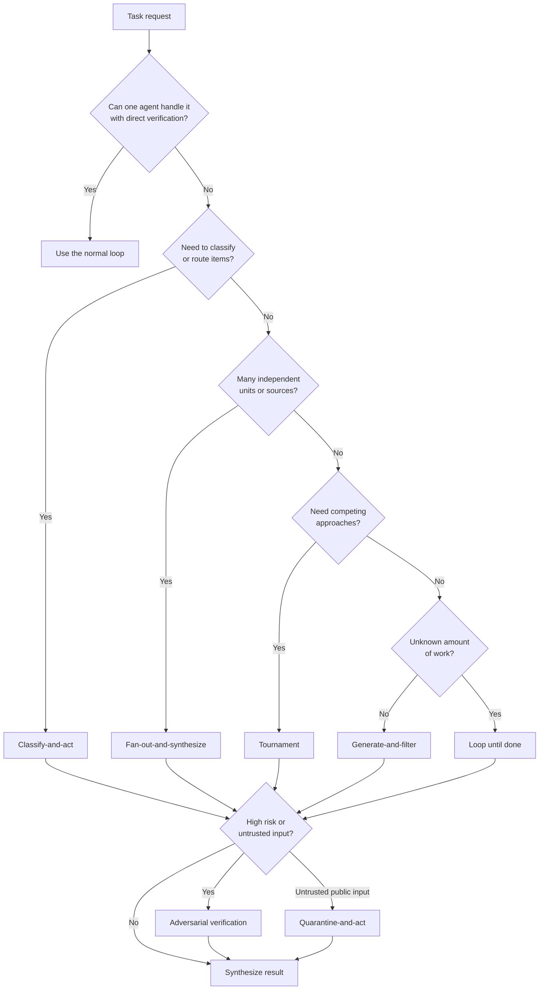
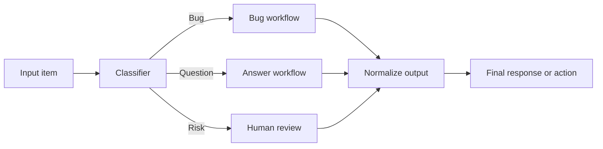
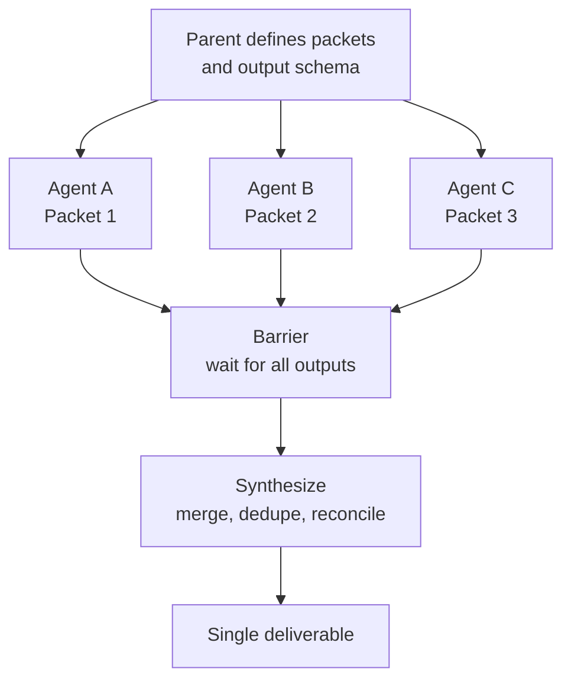
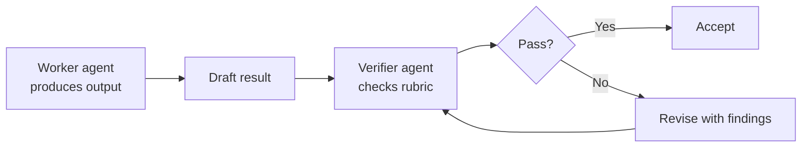
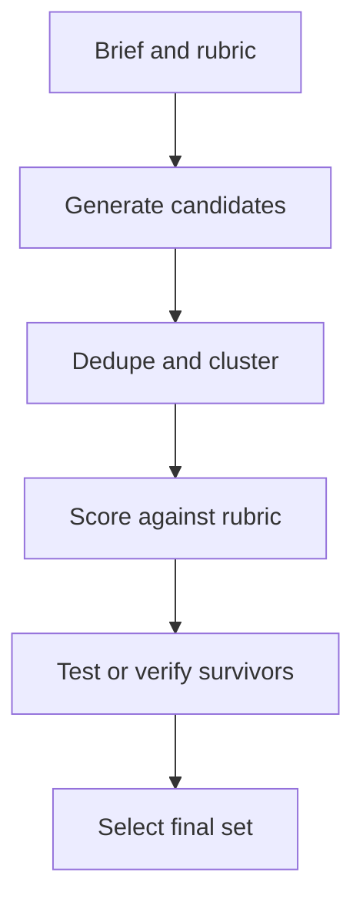
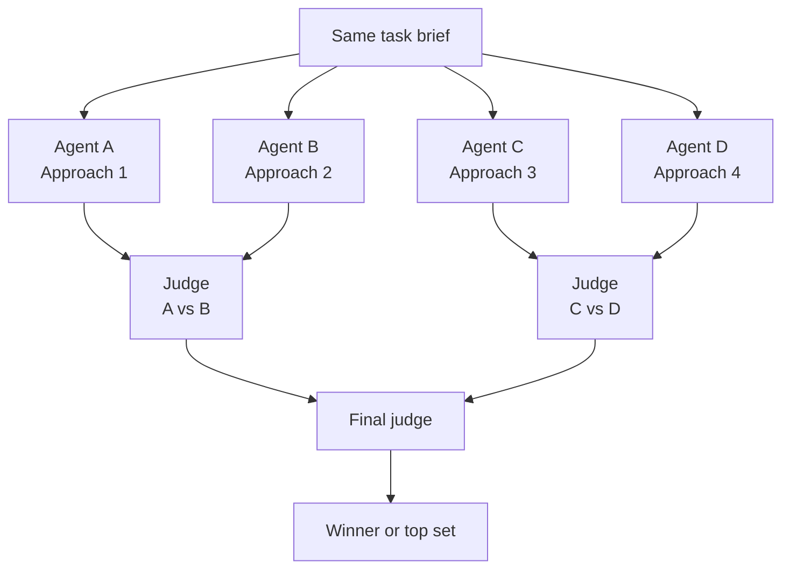
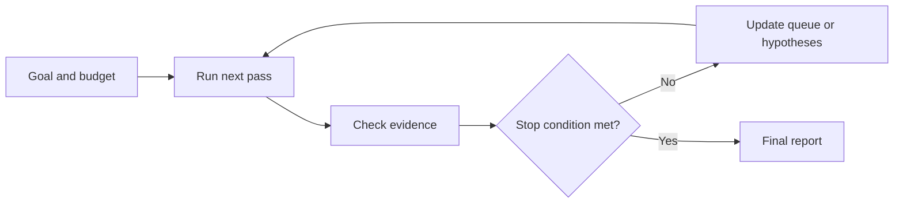
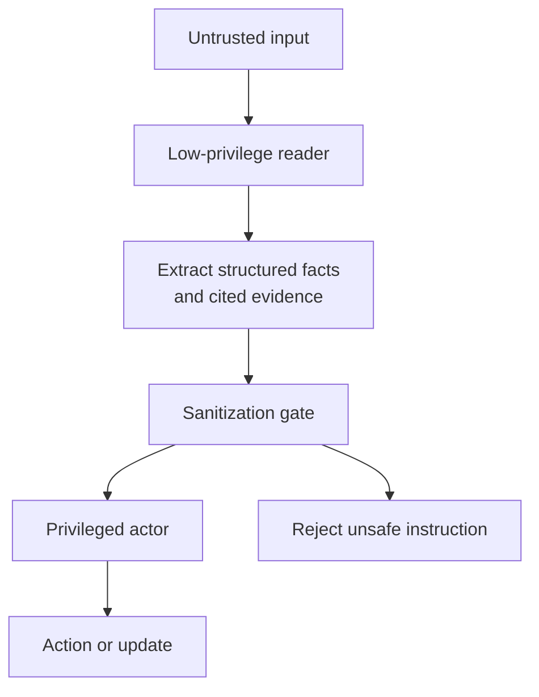

# Agent Workflow Patterns

Version: 0.1.0
Last updated: 2026-06-04

Reusable patterns for deciding when a single agent loop is enough, when to split work across agents, and how to verify the result.

These patterns are adapted from Anthropic's dynamic workflow guidance for Claude Code. The names map closely to that source, but the guidance here is runtime-neutral: the same shapes apply to Claude Code workflows, Codex sub-agents, scripted agent harnesses, or human-designed orchestration.

## When To Use A Workflow

Use an explicit workflow when the task has at least one of these properties:

- many independent units of work
- high-value output that needs independent verification
- adversarial or taste-based judgment
- unknown number of passes before completion
- large context that would cross-contaminate findings
- risk that the agent will stop early, prefer its own answer, or drift from the original goal

Do not build a workflow for a routine single edit, a small answer, or a task where the orchestration would cost more than the work.

## Selection Map



Source: [diagrams/selection-map.mmd](diagrams/selection-map.mmd)

## Pattern Summary

| Pattern | Use When | Core Shape | Watch For |
| --- | --- | --- | --- |
| Classify-and-act | Inputs need different handling, models, tools, or escalation paths. | Classifier routes each item to the right branch. | Classifier mistakes become routing mistakes; sample and verify. |
| Fan-out-and-synthesize | Work can be split by file, claim, source, ticket, candidate, module, or hypothesis. | Parallel agents produce structured outputs; one synthesizer merges them. | Cross-contamination if agents share too much context. |
| Adversarial verification | The answer is high-risk, subjective, or likely to inherit the author's blind spots. | Independent verifier checks output against a rubric. | Vague rubrics produce vague reviews. |
| Generate-and-filter | You need many candidate ideas, names, designs, fixes, or approaches. | Generate a wide set, dedupe, score, and keep only survivors. | Filtering too early can collapse diversity. |
| Tournament | Comparative judgment is easier than absolute scoring. | Multiple agents attempt the same task; judges compare pairs or brackets. | Judges need clear criteria and tie-breaking rules. |
| Loop until done | The number of passes is unknown. | Repeat work and verification until a stop condition is met. | Loops need hard budgets and observable stop conditions. |
| Quarantine-and-act | Untrusted input must be read but should not get access to privileged actions. | Reader agents summarize; privileged actors operate only on sanitized findings. | Keep the action boundary explicit and auditable. |

## Classify-And-Act

Use this when each item needs a different path.



Good fits:

- support queue triage
- issue routing
- model or tool selection
- claim type detection before fact checking
- deciding whether work should be automated or escalated

Minimum harness:

- input schema
- routing labels
- examples for each label
- confidence threshold
- sample audit of classifier decisions

## Fan-Out-And-Synthesize

Use this when the task naturally decomposes into independent work packets.



Good fits:

- deep research across sources
- codebase exploration by module
- claim-by-claim verification
- resume or ticket review
- large refactors split by call site or package

Minimum harness:

- packet boundaries
- shared output schema
- rules for conflicts and duplicates
- synthesis checklist
- spot checks on representative packets

## Adversarial Verification

Use this when the workflow needs an independent challenge before the output is trusted.



Good fits:

- code review
- security review
- technical claim checking
- business plan critique
- readiness or launch claims

Minimum harness:

- explicit rubric
- evidence standard
- severity labels
- pass/fail criteria
- rule for when the verifier can stop the loop

## Generate-And-Filter

Use this when breadth matters first, then quality.



Good fits:

- product names
- design directions
- implementation approaches
- research hypotheses
- incident theories

Minimum harness:

- target quantity
- diversity prompts or lanes
- exclusion rules
- scoring rubric
- final selection count

## Tournament

Use this when comparing two options is more reliable than assigning every option an absolute score.



Good fits:

- naming and positioning
- design exploration
- qualitative ranking
- choosing among implementation strategies
- evaluating generated drafts

Minimum harness:

- identical task brief
- comparison rubric
- judge independence
- bracket or pairwise schedule
- tie-break rule

## Loop Until Done

Use this when completion is observable but the number of passes is not known upfront.



Good fits:

- flaky test reproduction
- log investigation
- migration cleanup
- backlog triage
- recurring research or verification

Minimum harness:

- hard budget
- observable stop condition
- progress ledger
- duplicate suppression
- escalation path if the loop stalls

## Quarantine-And-Act

Use this as a safety wrapper when the workflow reads untrusted public content but may also need to take privileged action.



Good fits:

- public issue triage
- inbound email or form processing
- web research that could influence live changes
- support queues with customer-provided text

Minimum harness:

- low-privilege reader role
- structured extraction schema
- prompt-injection and instruction filtering
- action allowlist
- audit log of reader-to-actor handoff

## Common Compositions

| Workflow | Composition |
| --- | --- |
| Deep research | Fan-out sources, adversarially verify claims, synthesize cited report. |
| Root-cause investigation | Generate competing hypotheses, fan out evidence checks, refute weak theories, loop until one survives. |
| Large refactor | Classify call sites, fan out fixes, run tests, adversarially review risky changes. |
| Triage at scale | Classify items, dedupe, quarantine untrusted input, act or escalate, loop on the queue. |
| Memory or rule mining | Fan out session review, cluster repeated corrections, adversarially test candidate rules, distill survivors. |
| Taste-based exploration | Generate candidates, filter by rubric, run tournament for the finalists. |

## Prompt Template

```text
Use an explicit workflow for this task.

Goal:
- <desired outcome>

Pattern:
- <classify-and-act | fan-out-and-synthesize | adversarial verification | generate-and-filter | tournament | loop until done | quarantine-and-act>

Work packets:
- <how to split the work, if applicable>

Rubric:
- <what good looks like>

Verification:
- <evidence required before completion>

Budget and stop condition:
- <token/time/tool budget>
- <condition that means done>
- <condition that means escalate or stop>
```

## References

- [Orchestrate subagents at scale with dynamic workflows](https://code.claude.com/docs/en/workflows)
- [Original X discussion](https://x.com/trq212/status/2061907337154367865)
