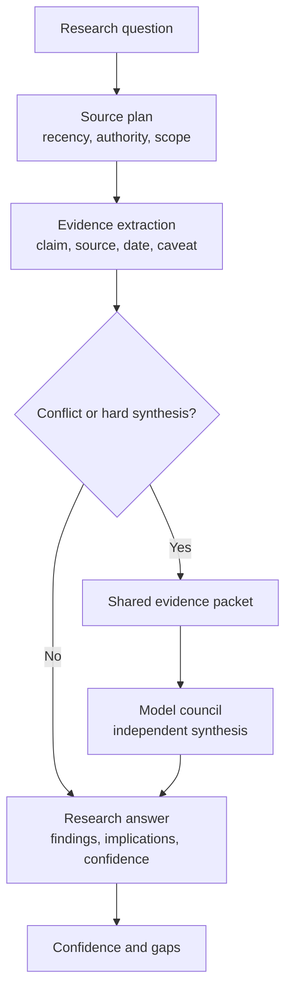

# Deep Research

`deep-research` is a skill for source-backed research and decision-ready synthesis.

It structures research into source collection, evidence extraction, uncertainty handling, and synthesis.

## What It Does

- scopes the research question and decision context
- chooses source depth based on risk and recency
- prefers primary sources and official documentation
- tracks evidence, conflicts, uncertainty, and confidence
- escalates hard synthesis to `model-council`

## Install

Copy this directory into your agent skill directory:

```text
skills/deep-research/
```

The minimum install is `SKILL.md`. Keep `references/` when you want the source quality guidance.

## Try It

```text
Use deep-research to compare three current API gateway options for a multi-model agent harness. Include sources, dates, tradeoffs, and what remains uncertain.
```

## Output

The skill usually produces:

- research question
- sources checked
- findings
- source conflicts
- implications
- confidence and gaps

For difficult synthesis, it prepares a source packet and invokes `model-council` so independent workers reason from the same evidence.

## Research To Council Flow


