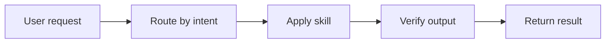

# Diagramming

Create useful diagrams with a two-path workflow:

- Mermaid first for working diagrams, repo docs, quick iteration, and diagrams that should remain easy to edit inline.
- D2 second for diagrams that need stronger visual polish, cleaner exports, and better final-image quality.

This is the default routing rule unless the user explicitly asks for one engine.

## Engine Selection

Use Mermaid when:

- the diagram should live in Markdown, docs, or code review
- people will edit the source inline
- speed matters more than presentation polish
- the output is a flowchart, sequence diagram, architecture sketch, ER diagram, user journey, or timeline

Use D2 when:

- the diagram is becoming a durable asset
- the destination is a slide, exported image, wiki attachment, report, or stakeholder document
- layout quality, spacing, and final visual fit matter more
- the diagram is dense enough that Mermaid looks cramped

If both are useful:

1. Start in Mermaid to converge on structure.
2. Rebuild in D2 once the story is stable.

## Working Method

1. Identify the destination: inline docs, working artifact, exported asset, report, or presentation.
2. Pick Mermaid or D2 based on that destination.
3. Reduce the story to the smallest readable diagram.
4. Keep labels short and concrete.
5. Use color sparingly and semantically.
6. Render and inspect when tooling is available.
7. Tighten wording before treating the diagram as finished.

## Mermaid Path

Use Mermaid as the default.

Recommended patterns:

- Use `flowchart LR` for most process and architecture sketches.
- Use sequence diagrams when time/order matters more than system shape.
- Use subgraphs only when grouping clarifies the story.
- Split one crowded diagram into two diagrams instead of forcing everything into one canvas.
- Keep node labels short enough to remain readable in rendered output.

Example:



## D2 Path

Use D2 once the diagram needs to look more final.

Recommended patterns:

- Prefer `elk` layout for the first polished pass.
- Use containers deliberately; do not add them unless they tell part of the story.
- Add color only where it carries meaning.
- Reduce labels before adding more positional control.
- Keep source text understandable so the diagram remains maintainable.

Example:

```d2
direction: right

request: User request
router: Route by intent
skill: Apply skill
check: Verify output
reply: Return result

request -> router -> skill -> check -> reply
```

## Quality Gate

Before finishing, verify:

- the engine choice matches the destination
- labels are concise
- the diagram has one clear story
- the visual hierarchy is obvious
- color and styling are consistent and meaningful
- exported output is readable at the size it will be used
- source text is still maintainable

## Anti-Patterns

Avoid:

- using a diagram when a short list is clearer
- packing multiple stories into one diagram
- using color as decoration instead of meaning
- adding long prose inside nodes
- making a polished D2 asset before the diagram's structure has stabilized
- shipping a diagram without rendering or at least syntax-checking it when the target engine is available
