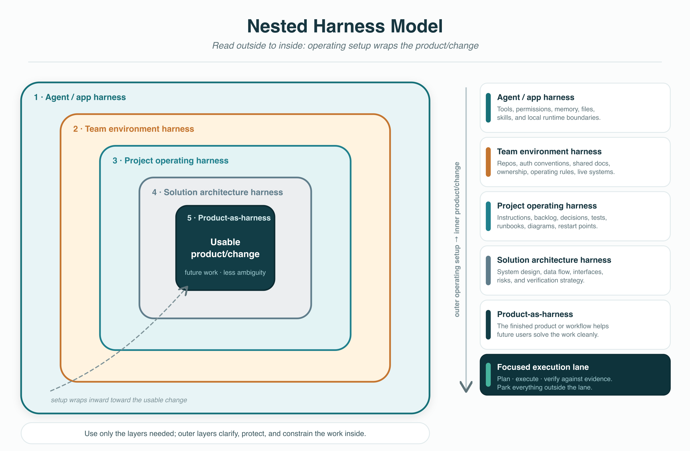

# Harness-First Project Coach

`harness-first-project-coach` helps an agent clarify a substantial project before implementation.

It sits one step before `project-harness-designer`: first it asks whether the goal is framed correctly, which facts and constraints matter, which support skills should be used, and what minimum operating harness is worth designing.

## What It Does

The skill coaches a project start through:

- focused Q&A for material unknowns
- goal altitude and source-of-truth checks
- privacy, auth, scope, and reversibility boundaries
- support-skill selection before inventing new process
- minimum harness design
- one first execution lane with evidence and stop conditions
- reusable learning capture

## Install

Copy this directory into your agent skill directory:

```text
skills/harness-first-project-coach/
```

The minimum install is `SKILL.md`. Keep `references/` and `assets/` when you want the diagrams, simple guide, support map, and review rubric.

## Try It

```text
Use harness-first-project-coach before implementation.

Highest practical goal:
Create a public-safe package from an internal agent workflow so other people can adapt it.

Context and source of truth:
The local repo, existing internal skill, and public-readiness constraints.

Musts and must-nots:
No private workspace names, no local paths, no raw logs, no secrets, no overbuilt scaffold.
```

The skill should ask only material clarifying questions, reframe the goal at the right altitude, identify the source of truth, select supporting skills or workflows, design the minimum harness, choose the first lane, and name verification evidence.

## Visual Model



The nested model is read outside to inside: operating setup wraps the product or concrete change being built.

## What It Prevents

- starting implementation before the goal and proof path are clear
- treating every project start as a generic plan
- loading too much context too early
- using a referenced skill just because it was mentioned
- publishing a reusable artifact without checking support skills, constraints, and evidence
- leaving the next session unable to restart

## Related Skills

- [Project Harness Designer](../project-harness-designer/README.md) produces the executable harness after the coaching pass.
- [Harness Composer](../harness-composer/README.md) splits complex work into parent and child harnesses.
- [Context Boundary Designer](../context-boundary-designer/README.md) decides what context belongs where.
- [Verification Harness Router](../verification-harness-router/README.md) chooses the smallest credible proof path.
- [Deterministic Controls](../deterministic-controls/README.md) moves behavior into code, schemas, checks, or gates when wording is not enough.

## Public Readiness

This public package keeps the reusable method, diagrams, simple guide, support map, and rubric. It removes team-repo paths, private workspace assumptions, local sync mechanics, and raw working notes.
