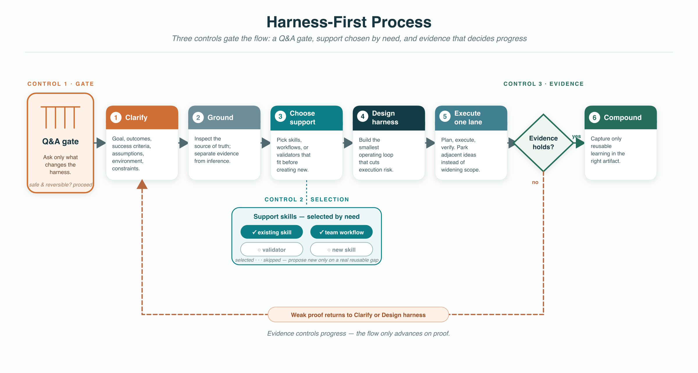
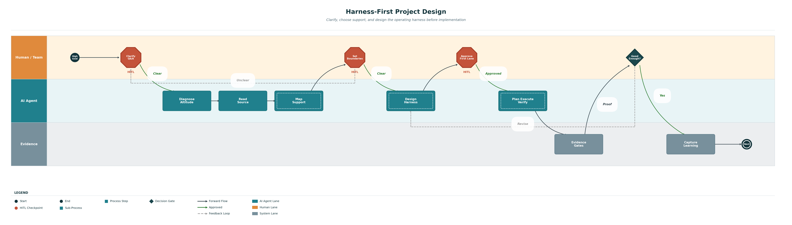

# How Harness-First Project Design Works

Version: 1.1.2
Last updated: 2026-06-17

## The Short Version

Harness-First Project Design creates the operating setup before building.

It asks:

1. What needs to be clarified before a good start is possible?
2. Are we framing the right goal?
3. What source owns the facts?
4. What boundaries matter?
5. What supporting skills or workflows should be used?
6. What is the minimum useful harness?
7. What context should be loaded or excluded?
8. What is the first lane?
9. What evidence proves the lane?
10. What learning should compound?

## Core Model

Diagram source: `../assets/nested-harness-model.svg`.

## Simplified Process

Diagram source: `../assets/simplified-harness-process.svg`.

## Workflow Diagram

Diagram source: `../assets/harness-first-project-design-workflow.json`.

## Nested Harness Model

The model is nested because people experience the operating setup as the outer wrapper around the concrete change being built. Read it from outside to inside:

1. Agent/app harness: tools, permissions, memory, browser, files, skills.
2. Team environment harness: repos, auth conventions, shared docs, operating rules.
3. Project operating harness: instructions, backlog, decisions, tests, runbooks, diagrams.
4. Solution architecture harness: system design, data flow, interfaces, verification strategy.
5. Product-as-harness: the thing being built may help future users solve work.

## Ten-Step Method

1. Q&A: clarify the goal, outcomes, success criteria, constraints, assumptions, environment, and stop conditions.
2. Altitude: restate the highest practical goal and classify the current framing.
3. Source: identify and inspect the source of truth before designing the work.
4. Boundary: define constraints, non-goals, privacy, auth, reversibility, and stop conditions.
5. Support: choose existing skills, workflows, or validators; propose new reusable skills only when a real support gap exists.
6. Harness: design the minimum operating structure needed before implementation.
7. Context: decide what to load, point to, defer, compress, isolate, or exclude.
8. Lane: pick one narrow execution lane.
9. Control: run Plan-Execute-Verify with explicit evidence gates.
10. Compound: preserve only reusable learning in the right artifact.

## Practical Rule

The harness should be smaller than the project risk, but strong enough that another session or teammate can continue without guessing.
