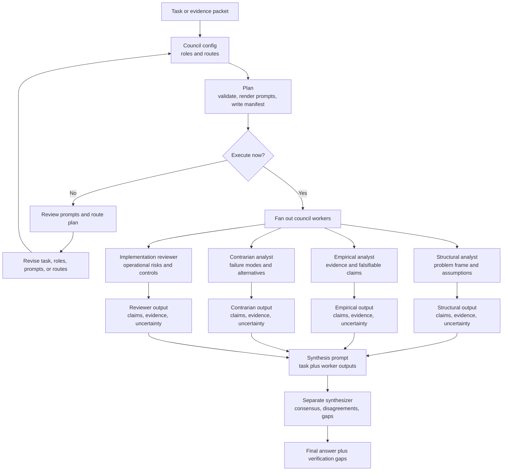

# Model Council

`model-council` runs independent model workers and a separate synthesis pass.

It is useful for difficult decisions, research synthesis, high-risk claims, and benchmark comparisons where a single model answer is not enough evidence.

## What It Does

- defines council roles with distinct responsibilities
- keeps worker prompts isolated before synthesis
- routes OpenAI, Anthropic, Google, and xAI workers through local CLIs first
- provides a Vercel AI Gateway config as an API alternate option
- records prompts, command arrays, raw logs, model outputs, and synthesis output

## Install

Copy this directory into your agent skill directory:

```text
skills/model-council/
```

The minimum install is `SKILL.md`. Keep `references/` when you want the full workflow notes.

## Runner

The companion runner lives at:

```text
tools/model-council-runner/
```

Base runner flow:



The full documentation includes separate workflow diagrams for the `base`, `adversarial`, `stress-test`, and `extended` council levels: [Model Council And Deep Research](../../docs/model-council-and-deep-research.md).

Validate and dry-plan the base local CLI council:

```bash
python3 tools/model-council-runner/scripts/council_runner.py validate \
  --config tools/model-council-runner/configs/local-cli.base.json \
  --task tools/model-council-runner/fixtures/smoke-task.json

python3 tools/model-council-runner/scripts/council_runner.py plan \
  --config tools/model-council-runner/configs/local-cli.base.json \
  --task tools/model-council-runner/fixtures/smoke-task.json \
  --run-dir /tmp/model-council-smoke \
  --force
```

Run `execute` only when you intend to spend model tokens:

```bash
python3 tools/model-council-runner/scripts/council_runner.py execute \
  --manifest /tmp/model-council-smoke/manifest.json
```

## Related Skills

- `deep-research` uses this skill when research claims need independent review.
- `deterministic-controls` is useful when turning council routing into production policy.
- `verification-harness-router` is useful when deciding what proof is enough after synthesis.
