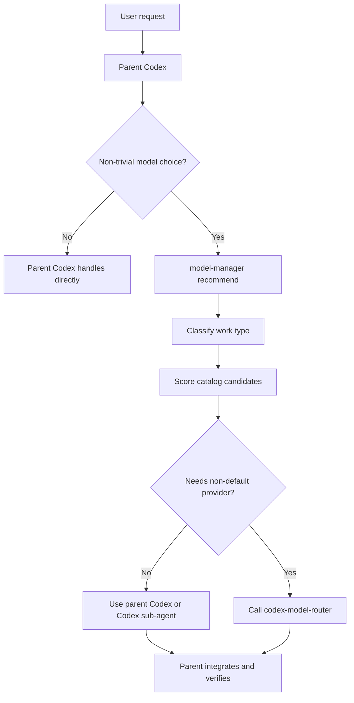
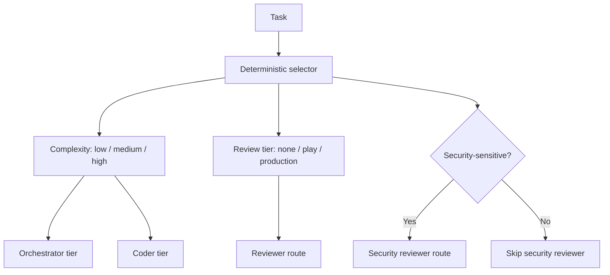

# Model Manager Architecture

Version: 0.2.0
Last updated: 2026-06-16

## Boundary

Model Manager owns model policy. It does not replace Codex as the parent executor and does not directly execute provider calls except where a provider router is explicitly invoked by the parent.

The provider router remains the execution adapter. Model Manager sits above it.

## Components

1. `model-manager`
   - Entry skill for deciding whether policy routing is useful.
   - Calls the deterministic recommender for non-trivial choices.

2. `model-delegator`
   - Classifies the work type.
   - Decides whether delegation adds value.
   - Chooses role shapes such as reviewer, researcher, local/private reader, or architecture critic.

3. `model-system`
   - Provides a public-friendly role stack in `data/model_system.json`.
   - Maps each task to complexity (`low`, `medium`, `high`), review tier (`play`, `production`, or none), and security-review need.
   - Resolves configured selector, orchestrator, coder, reviewer, and security-review routes from `model_catalog.json`.
   - Marks configured routes as blocked when privacy or backend availability constraints would make them unsafe.

4. `model-cost-optimizer`
   - Scores candidate models/settings against task type, benchmark fit, cost tier, latency tier, availability, and privacy constraints.
   - Uses Artificial Analysis for general model quality, speed, latency, and pricing when a live cache is available.
   - Uses DeepSWE for long-horizon software engineering routing.

5. `model-router`
   - Documents when to call the existing `codex-model-router`.
   - Keeps provider execution explicit and auditable.

## Data Flow

The role-stack view sits beside the ranked recommendation list:

## Determinism

The first production slice keeps recommendation logic deterministic:

- Keyword and flag based work classification.
- Versioned model catalog.
- Versioned model-system role stack.
- Sanitized recommendation values generated from an approved Artificial Analysis cache.
- Numeric scoring with explicit weights.
- JSON output for assertions and logging.
- Eval cases that fail when expected routes change.

The model can still use judgment before calling the CLI, but the CLI owns the final repeatable route plan once task metadata is supplied. The role stack is intentionally deterministic rather than selector-model-driven so users can audit why a route was chosen.

## Failure Modes

| Failure | Behavior |
|---|---|
| Artificial Analysis API key missing | Use committed catalog and say live pricing was not refreshed. |
| Artificial Analysis cache refreshed | Store only sanitized recommendation values; keep raw cache ignored. |
| DeepSWE leaderboard changes | Update `model_catalog.json`, source notes, and eval expectations together. |
| Requested provider unavailable | Recommender marks route as unavailable or falls back to parent Codex/local route. |
| Configured model-system route violates privacy | Role route is marked unavailable and includes a blocked reason. |
| Configured role references a missing catalog model | Role route is marked unavailable with a catalog warning. |
| Task needs tools/apps/MCP | Prefer parent Codex unless a sidecar is clearly bounded. |
| Privacy/local-only task | Prefer LM Studio/local route and avoid external providers. |

## Relationship To Model Council

`model-council-skill` is an adversarial evaluation method. Model Manager is routing infrastructure. Model Council can call Model Manager later when it needs provider diversity or cost-aware role selection.
