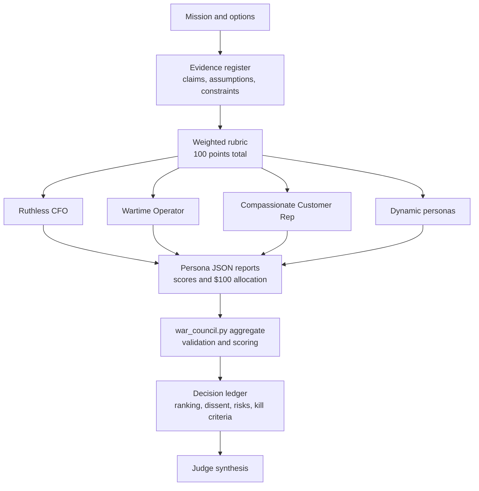

# War Council

`war-council` is a decision harness for uncomfortable tradeoffs.

It turns advisor personas into an auditable workflow: define the decision, build an evidence register, score options with a weighted rubric, force each persona to allocate a $100 war chest, and synthesize the result into a decision ledger.

## What It Does

- scopes a decision before advising
- uses fixed personas: Ruthless CFO, Wartime Operator, Compassionate Customer Rep, and a neutral Judge
- adds 1-2 dynamic personas based on the decision type
- requires every persona to score the same options against the same rubric
- preserves agreement, disagreement, lone dissent, risks, and kill criteria
- validates scoring and allocation with a deterministic Python script
- writes a short decision ledger for later audit

## Use It For

- choosing between product, technical, hiring, vendor, launch, or investment options
- surfacing the uncomfortable tradeoff behind an easy-to-rationalize answer
- ranking initiatives with explicit opportunity cost
- forcing a decision memo to show evidence, assumptions, dissent, and reversal triggers

Do not use it for ordinary brainstorming, copyediting, or low-stakes preference lists.

## Install

Copy this directory into your agent skill directory:

```text
skills/war-council/
```

The minimum install is `SKILL.md`. Keep `references/` and `scripts/` when you want the full auditable workflow and deterministic scoring.

## Try It

```text
Use war-council to decide whether we should launch now, delay for automation, or cancel the project. Treat customer trust, opportunity cost, and execution risk as the major tradeoffs.
```

## Run The Deterministic Check

```bash
cd skills/war-council
python3 scripts/war_council.py self-test
```

Expected result:

```json
{"passed": true}
```

## Aggregation Flow



## Public Boundary

This package is a clean public pattern. It does not include private examples, local paths, customer material, secrets, or model-provider credentials.

## Related Skills

- `model-council` for independent multi-model synthesis.
- `deterministic-controls` for deciding which parts of an agent workflow should move into schemas, tests, or code.
- `verification-harness-router` for choosing proof paths after the decision.
