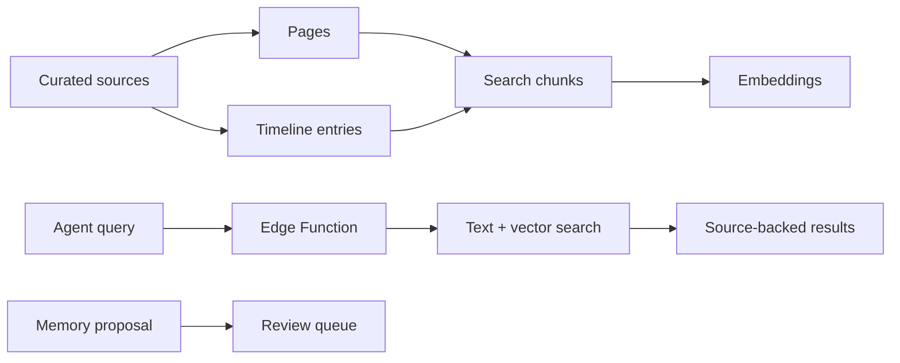

# Agent Memory Starter

A public-safe starter kit for source-backed AI agent memory.

This package shows one practical shape for durable memory:

- curated pages for current truth
- timeline entries for dated evidence
- searchable chunks for retrieval
- update proposals for review before writes
- text plus vector search
- fixture evals that prove retrieval still works

It is intentionally small. It is a reference implementation, not a hosted product.

## What Is Included

| Path | Purpose |
| --- | --- |
| `references/schema.sql` | Postgres and pgvector schema for pages, sources, timeline entries, chunks, proposals, search, stats, and embedding queue functions. |
| `functions/embed-agent-memory/` | Supabase Edge Function for auth, embedding, search, backfill, page reads, stats, and update proposals. |
| `scripts/agent_memory.py` | Small local CLI wrapper for calling the deployed Edge Function without printing secrets. |
| `fixtures/sample-corpus.json` | Fake memory corpus for examples and tests. |
| `evals/search-quality.json` | Public-safe retrieval eval cases. |
| `scripts/run_fixture_eval.py` | Deterministic local eval that needs no live database or API key. |
| `docs/architecture.md` | Architecture notes, trust boundaries, and production hardening checklist. |

## Architecture



## Setup Outline

1. Create a Supabase project or use an existing private project.
2. Apply `references/schema.sql` as a migration.
3. Expose the `agent_memory` schema to the Supabase API if your deployment uses PostgREST or Edge Function RPC against that schema.
4. Grant API access only to the roles your deployment needs. The starter schema grants service-role access for server-side function calls.
5. Deploy `functions/embed-agent-memory`.
6. Set the required function secrets:

```bash
supabase secrets set \
  OPENAI_API_KEY=... \
  AGENT_MEMORY_FUNCTION_TOKEN=...
```

7. Call the function through `scripts/agent_memory.py` or an equivalent client.

Do not commit real `.env` files, function tokens, API keys, exported memories, or private corpus data.

## Function Modes

The Edge Function accepts JSON `POST` requests:

| Mode | Purpose |
| --- | --- |
| `stats` | Return page, chunk, source, proposal, and embedding counts. |
| `text_search` | Search without creating a query embedding. |
| `query` | Create a query embedding and run hybrid search. |
| `page` | Return one page bundle by slug. |
| `backfill` | Embed chunks missing current embeddings. |
| `propose_update` | Insert a reviewable memory update proposal. |

Every request must include:

```text
x-agent-memory-token: <your function token>
```

## CLI Examples

```bash
export AGENT_MEMORY_FUNCTION_URL="https://example.supabase.co/functions/v1/embed-agent-memory"
export AGENT_MEMORY_FUNCTION_TOKEN="replace-with-a-local-secret"

python3 tools/agent-memory-starter/scripts/agent_memory.py stats
python3 tools/agent-memory-starter/scripts/agent_memory.py text-search "release gate" --limit 5
python3 tools/agent-memory-starter/scripts/agent_memory.py page systems/release-gates
```

The CLI reads secrets from environment variables and does not print them.

## Run The Public Eval

```bash
python3 tools/agent-memory-starter/scripts/run_fixture_eval.py
```

Expected result:

```json
{
  "passed": true
}
```

The eval uses fake fixture data and deterministic text scoring. It does not prove semantic search quality. It proves the package has source-backed fixture coverage and that ranking regressions can be caught without live secrets.

## Production Checklist

Before using this pattern with real memory:

- define allowed and forbidden source classes
- add retention and deletion rules
- decide whether agents can write directly or only propose updates
- add redaction and error-log controls
- run search evals against sanitized fixture cases
- test unauthorized requests
- verify the function never logs secrets, embeddings payloads, or private memory text unnecessarily
- document how exports and backups are handled

## Privacy Boundary

This starter contains only fictional data. It deliberately avoids private memories, raw transcripts, local machine paths, live project identifiers, and credentials.
