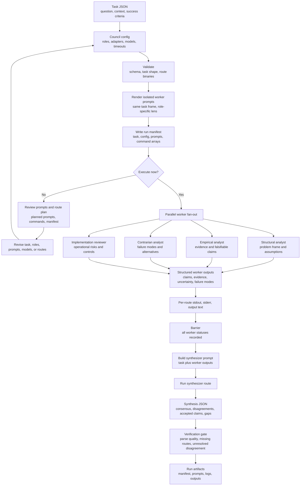

# Model Council Runner

This runner turns the `model-council` skill into a repeatable local harness.

It has two execution paths:

1. Local CLIs first: Codex for OpenAI, Claude Code for Anthropic, Antigravity for Google, and Grok Build for xAI.
2. Vercel AI Gateway as an API alternate option: one OpenAI-compatible endpoint for hosted provider routing.

## Flow



Source: [diagrams/base-council-flow.mmd](diagrams/base-council-flow.mmd)

## Commands

Validate a config and task:

```bash
python3 tools/model-council-runner/scripts/council_runner.py validate \
  --config tools/model-council-runner/configs/local-cli.base.json \
  --task tools/model-council-runner/fixtures/smoke-task.json
```

Create a dry-run plan without model calls:

```bash
python3 tools/model-council-runner/scripts/council_runner.py plan \
  --config tools/model-council-runner/configs/local-cli.base.json \
  --task tools/model-council-runner/fixtures/smoke-task.json \
  --run-dir /tmp/model-council-smoke \
  --force
```

Execute an existing manifest:

```bash
python3 tools/model-council-runner/scripts/council_runner.py execute \
  --manifest /tmp/model-council-smoke/manifest.json
```

`execute` runs model calls and may spend credits. `plan` and `validate` do not call models.

## Local CLI Requirements

Install and authenticate only the routes you plan to run:

- `codex exec` for OpenAI models
- `claude -p` for Anthropic models
- `agy --print` for Google models through Antigravity
- `grok --prompt-file` for xAI Grok Build

The local sample config pins model aliases and effort settings for repeatable runs. Verify aliases on the target machine before spending benchmark credits, and add a `grok_cli` worker when including xAI in a council run.

## Vercel AI Gateway

Set one of:

```bash
export AI_GATEWAY_API_KEY="..."
export VERCEL_OIDC_TOKEN="..."
```

Then use:

```bash
python3 tools/model-council-runner/scripts/council_runner.py validate \
  --config tools/model-council-runner/configs/vercel-gateway.base.json \
  --task tools/model-council-runner/fixtures/smoke-task.json
```

Verify current model IDs with your Vercel account before running a paid benchmark.

```bash
python3 tools/model-council-runner/scripts/council_runner.py models \
  --config tools/model-council-runner/configs/vercel-gateway.base.json
```

## Run Directory

Each run directory contains:

- `task.json`
- `config.json`
- `manifest.json`
- `commands.json`
- `prompts/*.md`
- `outputs/*.txt`
- `logs/*.stdout`
- `logs/*.stderr`

Treat run directories as execution artifacts. Keep reusable configuration, templates, and benchmark setup in the repo; keep generated prompts, outputs, and logs in a run workspace.
